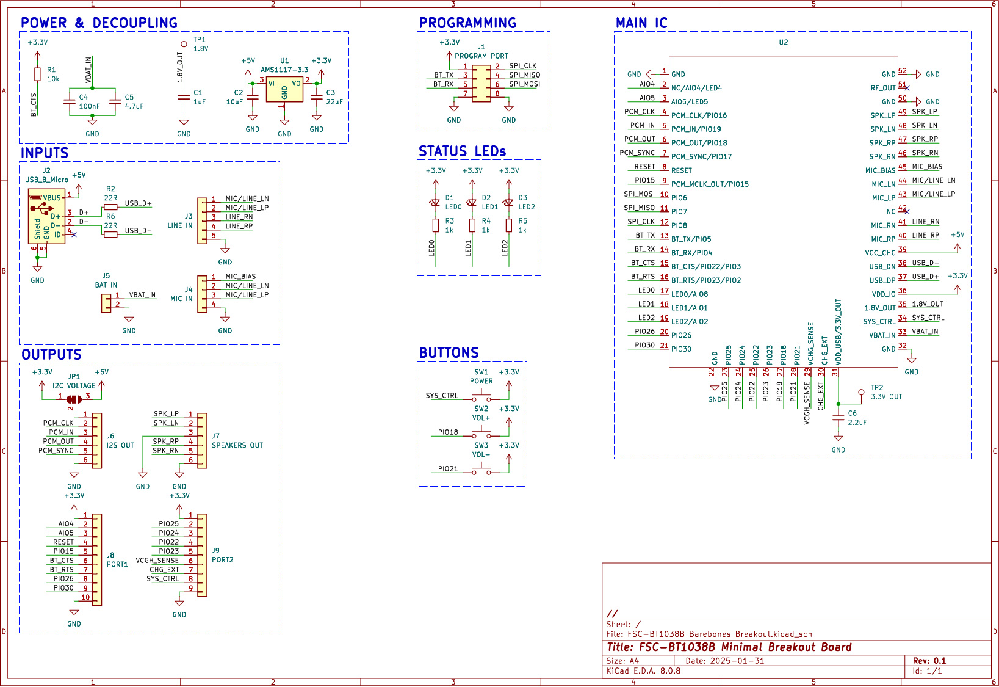

# FSC-BT1038B Breakout Board

_A breakout board designed using KiCad. AIM: test out Auracast protocols to (eventually) build a Bluetooth speaker_

## Overview

This repository contains the design files for a custom breakout board created in KiCad. The board is intended for evaluating the [Feasycom FSC-BT1038B module](https://www.feasycom.com/fsc-bt1038b). All pins are broken out and grouped for your convenience.

## Features

-   **Modern IC:** board based on the [QCC3084](https://www.qualcomm.com/products/internet-of-things/consumer/audio/qcc30xx-series/qcc3084) IC by Qualcomm.
-   **(Relatively) Compact Design:** ~60x45mm
-   **Voltage Compatibility:** it accepts 5v USB, stepped to 3.3v via an AMS1117. The FSC-BT1038B offers additional 1.8v out (TP1) and 3.3v out (~50mA max, TP2).
-   **Pinout:** all pins are broken out and labeled on the silkscreen. 
-   **Additional Features:** three status LEDs connected to the LED0, LED1 and LED2 pins. Three user buttons are also present on the board (see silkscreen labelling).

## Schematic



## Checklist

### 🛠️ Project Status

| Component | Status |
| -------- | ------- |
| Schematic | ✅ Done |
| PCB Layout | ✅ Done |
| Gerber Files | ✅ Generated |
| Fabrication | ✅ Done |
| Assembly | ✅ Done |
| Testing | ✅ Done |
| Firmware | 🔄 In Progress |
| Documentation | 🔄 In Progress |

Please note - the board has been tested and functions as intended.

## Getting Started

### Prerequisites

Ensure you have the following installed:

- [KiCad](https://www.kicad.org/) (version 8.0 or later)
- Add the custom libraries to your (local) project. They're included in this repo in the hardware/libraries/ folder

## Files & Directory Structure

```
📂 kicad-breakout/
 ├── 📂 documentation/			# Documentation (WIP) - find in here the schematic (pdf, svg and jpg)
 ├── 📂 firmware/				# Firmware
 ├── 📂 hardware/				# KiCad design files
 	├── 📂 bom/					# Interactive BOM (html)
 	├── 📂 fabrication/			# Fabrication files
 	├── 📂 libraries/			# Please don't forget to include these!
```

## Contribution

Contributions are welcome! Feel free to submit a pull request or open an issue for discussion.

## License

This project is licensed under the [CERN-OHL-S v2](https://ohwr.org/cern_ohl_s_v2.txt).